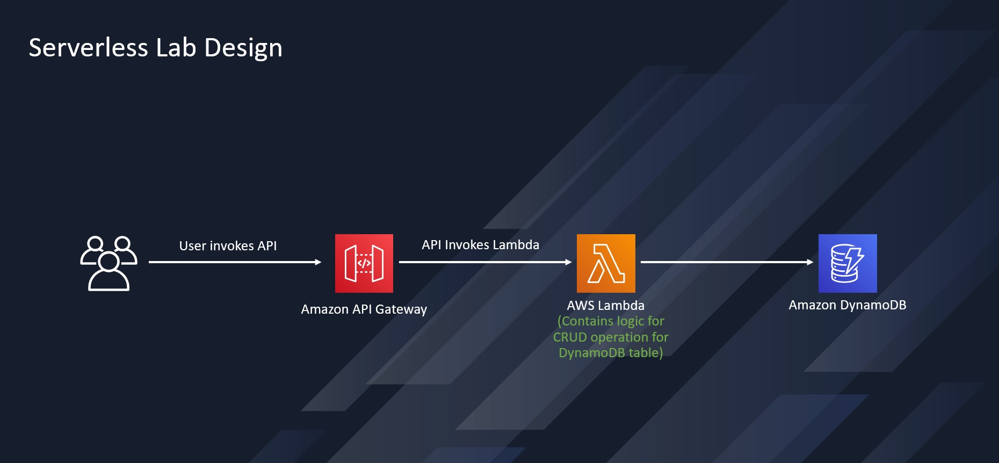

# Serverless-api
## High Level Design
Let's start with the High Level Design. 


High Level Design An Amazon API Gateway is a collection of resources and methods. For this tutorial, you create one resource (DynamoDBManager) and define one method (POST) on it. The method is backed by a Lambda function (LambdaFunctionOverHttps). That is, when you call the API through an HTTPS endpoint, Amazon API Gateway invokes the Lambda function.

The POST method on the DynamoDBManager resource supports the following DynamoDB operations:

- Create, update, and delete an item.

- Read an item.

- Scan an item.

- Other operations (echo, ping), not related to DynamoDB, that you can use for testing.

The request payload you send in the POST request identifies the DynamoDB operation and provides necessary data. For example:

The following is a sample request payload for a DynamoDB create item operation:
```JSON
{
    "operation": "create",
    "tableName": "lambda-apigateway",
    "payload": {
        "Item": {
            "id": "1",
            "name": "Bob"
        }
    }
}
```
The following is a sample request payload for a DynamoDB read item operation:
```JSON
{
    "operation": "read",
    "tableName": "lambda-apigateway",
    "payload": {
        "Key": {
            "id": "1"
        }
    }
}
```
# Setup

## Create Lambda Execution Role

### Create IAM Policy
Create a IAM policy to attach with lambda execution role

To create an policy:

- Open IAM Service in console
- Click on Policies on left side menu
- Click on 'Create policy' button on right side
- Select the "lambda" as service
- Toggle Visual to JSON to open policy editor and copy the below policy which is needed for lambda function to write data to Dynamodb and upload logs.

```JSON
{
"Version": "2012-10-17",
"Statement": [
{
  "Sid": "Stmt1428341300017",
  "Action": [
    "dynamodb:DeleteItem",
    "dynamodb:GetItem",
    "dynamodb:PutItem",
    "dynamodb:Query",
    "dynamodb:Scan",
    "dynamodb:UpdateItem"
  ],
  "Effect": "Allow",
  "Resource": "*"
},
{
  "Sid": "",
  "Resource": "*",
  "Action": [
    "logs:CreateLogGroup",
    "logs:CreateLogStream",
    "logs:PutLogEvents"
  ],
  "Effect": "Allow"
}
]
}
```
- Click Next
- Provide the Policy Name as 'lambda-apigateway' and save.

### Create IAM Role
- Click on Roles on left side menu
- Click on 'Create role' button on right side
- Select 'AWS Service' as trusted entity type
- Select Service as 'Lambda' & click Next
- Select the 'lambda-apigateway' policy to attach & click Next
- Provide Role name as 'lambda-apigateway-role' and click 'Create role'


## Create Lambda Function
- Open the Lambda service in console
- Click on 'Create function' in lambda console
- Select "Author from scratch". Use name 'LambdaFunctionOverHttps' , select Python 3.9 as Runtime. Under Permissions, select "Use an existing role", and select lambda-apigateway-role that we created, from the drop down
- Click "Create function"
- image
- Replace the default code with the below code snippet and click "Save"

```PYTHON
from __future__ import print_function

import boto3
import json

print('Loading function')


def lambda_handler(event, context):
    '''Provide an event that contains the following keys:

      - operation: one of the operations in the operations dict below
      - tableName: required for operations that interact with DynamoDB
      - payload: a parameter to pass to the operation being performed
    '''
    #print("Received event: " + json.dumps(event, indent=2))

    operation = event['operation']

    if 'tableName' in event:
        dynamo = boto3.resource('dynamodb').Table(event['tableName'])

    operations = {
        'create': lambda x: dynamo.put_item(**x),
        'read': lambda x: dynamo.get_item(**x),
        'update': lambda x: dynamo.update_item(**x),
        'delete': lambda x: dynamo.delete_item(**x),
        'list': lambda x: dynamo.scan(**x),
        'echo': lambda x: x,
        'ping': lambda x: 'pong'
    }

    if operation in operations:
        return operations[operation](event.get('payload'))
    else:
        raise ValueError('Unrecognized operation "{}"'.format(operation))
```

### Test Lambda Function
Let's test our newly created function. We haven't created DynamoDB and the API yet, so we'll do a sample echo operation. The function should output whatever input we pass.
- Click on 'Test' & select 'Create new test event'
- Provide the Event Name
- Paste the following JSON into the event JSON and save

```JSON
{
    "operation": "echo",
    "payload": {
        "somekey1": "somevalue1",
        "somekey2": "somevalue2"
    }
}
```
- Click Test and it will execute the test event and provide the output in console.
- image


## Create DynamoDB Table
Let's create a DynamoDB table for lambda function to use.


### Steps:
- Open the DynamoDB service
- Click on 'Create table'
- Fields to fill:
    - Table name:- lambda-apigateway
    - Partition key:- id (string)
- Click on 'Create table'
- image


## Create API

### To create the API
- Open the API Gateway console
- Click on 'Create API'
- Select REST API and click Build
- image RESTAPI
- Provide API Name as 'DynamoDBOperations' and click 'Create API'
- image RESTAPI2
- Each API is collection of resources and methods that are integrated with backend HTTP endpoints, Lambda functions, or other AWS services. Typically, API resources are organized in a resource tree according to the application logic. At this time you only have the root resource, but let's add a resource next

- Click 'Create Resource' and provide name as 'DynamoDBManager' and Create resource
- image API Resource
- Now Select created resource i.e. '/DynamoDBManager' and click 'Create method' in left
- image APIMethod
- API-Lambda integration is done


### Deploy the API
Deploy the API by clicking on 'Deploy API' button on left side. You need to create a new stage for deploy, let's say 'prod' and click 'Deploy'

image API Deploy

Now We're all set to run our solution! To invoke our API endpoint, we need the endpoint url. In the "Stages" screen, expand the stage "Prod", select "POST" method, and copy the "Invoke URL" from screen.
- image APIInvoke


Let's test our solution!!
- The Lambda function supports using the create operation to create an item in your DynamoDB table. To request this operation, use the following JSON:
```JSON
{
    "operation": "create",
    "tableName": "lambda-apigateway",
    "payload": {
        "Item": {
            "id": "1234ABCD",
            "number": 5
        }
    }
}
```
- To execute our API from local machine, we are going to use Postman and Curl command. You can choose either method based on your convenience and familiarity.
    - To run this from Postman, select "POST" , paste the API invoke url. Then under "Body" select "raw" and paste the above JSON. Click "Send". API should execute and return "HTTPStatusCode" 200.
    - image POSTMAN-post
    - To run this from terminal using Curl, run the below
    ```bash
    $ curl -X POST -d "{\"operation\":\"create\",\"tableName\":\"lambda-apigateway\",\"payload\":{\"Item\":{\"id\":\"1\",\"name\":\"Bob\"}}}" https://$API.execute-api.$REGION.amazonaws.com/prod/DynamoDBManager
    ```

- To validate that the item is indeed inserted into DynamoDB table, go to Dynamo console, select "lambda-apigateway" table, click on "Explore table items" tab, and the newly inserted items should be displayed.
- image dynamodbitems


- To get all the inserted items from the table, we can use the "list" operation of Lambda using the same API. Pass the following JSON to the API, and it will return all the items from the Dynamo table
```JSON
{
    "operation": "list",
    "tableName": "lambda-apigateway",
    "payload": {
    }
}
```
- image POSTMAN-read

We have successfully created a serverless API using API Gateway, Lambda, and DynamoDB! Please make sure to delete the resources once done.